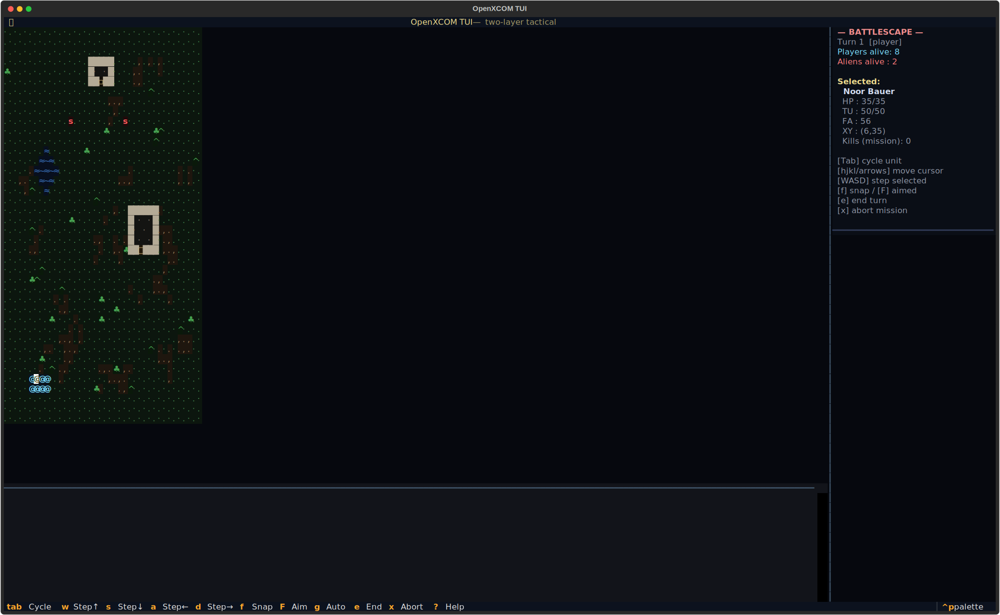
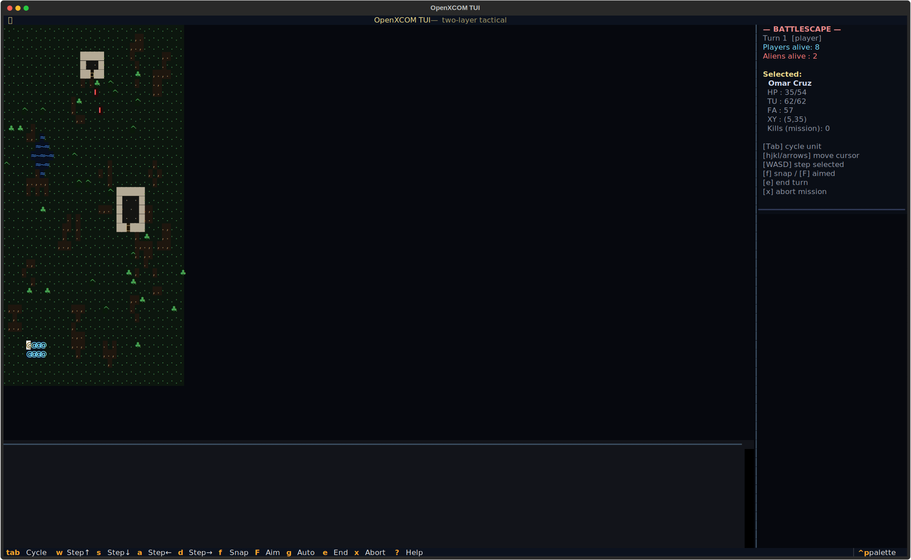

# openxcom-tui
Earth's last line of defense.




## About
UFOs are falling. Aliens are abducting. Your eight-agent squad has ten seconds of Time Units and a laser rifle. Run the geoscape: research plasma, manufacture hovertanks, re-equip the Skyranger. Drop into the night mission — LOS, TU combat, reaction fire. One panic, one grenade, and the whole squad is gone. Commander, your orders.

## Screenshots


## Install & Run
```bash
git clone https://github.com/akakabrian/openxcom-tui
cd openxcom-tui
make
make run
```

## Controls
### Geoscape (world map)

| key | action |
|-----|--------|
| ← ↑ ↓ → | move globe cursor |
| `space` / `p` | pause |
| `.` | advance 1 hour |
| `>` | advance 1 day |
| `r` | research menu |
| `m` | manufacture menu |
| `b` | base layout |
| `i` | intercept UFO |
| `u` | UFOpaedia |
| `h` | recenter on base |
| `t` | force-start a battle (debug) |
| `?` | help |
| `q` | quit |

### Battlescape (tactical)

| key | action |
|-----|--------|
| ← ↑ ↓ → | move crosshair |
| `w a s d` | step selected soldier |
| `tab` | cycle soldier selection |
| `f` | snap shot (25% TU) |
| `F` | aimed shot (60% TU) |
| `g` | auto burst (35% TU × 3) |
| `e` | end player turn |
| `x` | abort mission |

## Testing
```bash
make test       # QA harness
make playtest   # scripted critical-path run
make perf       # performance baseline
```

## License
MIT

## Built with
- [Textual](https://textual.textualize.io/) — the TUI framework
- [tui-game-build](https://github.com/akakabrian/tui-foundry) — shared build process
